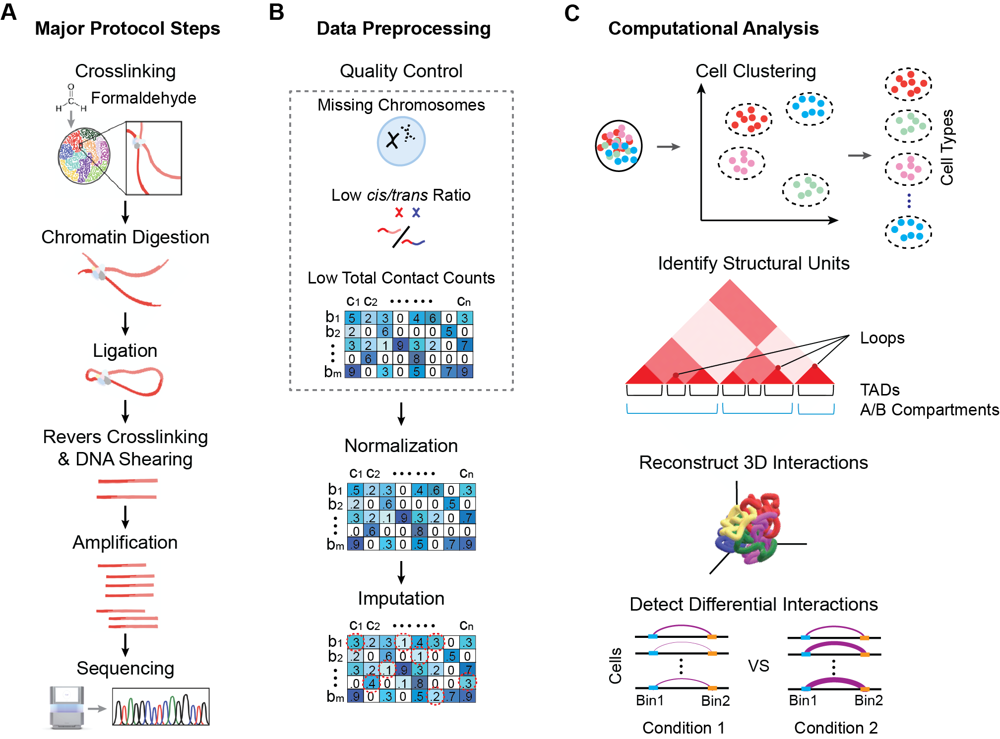

# scHi-C Evaluation - Data Quality Assessment for All Known Single Cell Chromatin Interaction Datasets (As of Sept. 1, 2024)
This is a repository for the scripts used to analyze and visualize the data quality of all scHi-C datasets generated by various protocols. 

If you use this work, please reference the corresponding paper: Dautle M., Chen Y. Single-Cell Hi-C Technologies and Computational Data Analysis. (Under Review)

### Requirements 
- Linux OS (for [MakeCoolerFiles.sh](./FigureGenerationScripts/Figure5/MakeCoolerFiles.sh))
- Python

##### Required Python Packages:
- numpy
- matplotlib
- seaborn
- pandas
- cooler 
- random
- glob
- os

## Overview of Major Steps in the scHiC Workflow

__Figure 1.__ Overview of major steps in scHi-C (A) experiments, (B) data preprocessing, and (C) computational analysis.
